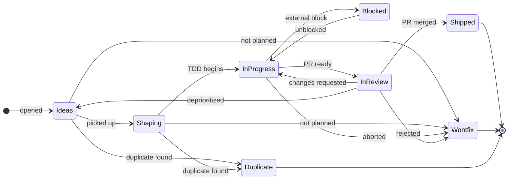

# Developer flow — Kno

> Conventions for everyday work on `dvhthomas/kno`. Augments the strict-TDD rule
> in [`AGENTS.md`](../../AGENTS.md). If something here contradicts AGENTS.md,
> AGENTS.md wins.

---

## Branch model

Trunk-based on `main`. Short-lived branches named `<type>/<issue#>-<slug>`:

```bash
git checkout -b feat/12-add-google-oauth
git checkout -b fix/47-config-leak
git checkout -b chore/3-bump-pydantic
git checkout -b docs/22-ops-manual
```

PR-only merges to `main`. No direct pushes once branch protection lands (Phase 2).

---

## PR-based flow

1. **Open or pick a GitHub issue.** Label it with type + area (the issue templates handle this).
2. **Branch:** `git checkout -b feat/<issue#>-<slug>`.
3. **Code via strict TDD** per [`AGENTS.md`](../../AGENTS.md). Multiple red→green commits in one PR is fine; each individual change still follows the cycle.
4. **Push, open PR with `Closes #<n>`.** CI (Phase 2 onward) runs `poe lint` + `poe typecheck` + `poe test`.
5. **Move the card on the Projects v2 board** to "In Review" → `in-review` label auto-applied within 15 min (see [Labels](#labels)).
6. **Review, merge.** Closing the issue auto-moves the card to "Done" → `done` label applied.
7. **Deploy is automatic from `main`** once Phase 2 task 2.8 (CI deploy workflow) ships.

---

## Labels

Four buckets. Each managed by a different mechanism so authority is clear:

| Bucket | Examples | Managed by |
|---|---|---|
| **Type** | `bug`, `enhancement`, `documentation`, `chore` | `.github/labels.yml` → synced by `.github/workflows/labels.yml` on push to `main` |
| **Lifecycle** | `shaping`, `in-progress`, `blocked`, `in-review`, `done` | `dvhthomas/project-label-sync` via `project-label-sync.yml` — driven from the Projects v2 board, runs every 15 min |
| **Area** | `area:agent`, `area:auth`, `area:web`, … | `.github/labels.yml` |
| **Status flags** | `blocked`, `release-blocker`, `wontfix`, `duplicate`, `good first issue` | `.github/labels.yml` |

**The big rule: don't apply lifecycle labels by hand.** Drag the issue's card on the Projects v2 board and the label appears automatically. Hand-applying `in-progress` works (the sync is bidirectional) but the board is the canonical source.

## Project board: how to move a card

Six columns on [project 3](https://github.com/users/dvhthomas/projects/3): **Ideas → Shaping → In Progress → Blocked → In Review → Shipped**. Three close-states (**Shipped**, **Wontfix**, **Duplicate**) — see closing rule below.

### State diagram



Every state has a documented inbound + outbound transition. No dangling states.

### Closing rule

**Issues do not close silently.** Every close must reference a PR, commit, or related issue. Three paths exist; any other close is a bug — reopen and ask.

1. **Auto-close (preferred).** `Closes #<n>` / `Fixes #<n>` / `Resolves #<n>` in a merged PR body **or** in any commit pushed to `main` auto-closes the issue and applies `done`. Use this 95% of the time.
2. **Manual close as Wontfix.** A comment citing a PR, commit, OR related issue is required (see Wontfix section below).
3. **Manual close as Duplicate.** A comment naming the canonical issue is required (see Duplicate section).

PRs are looser: a PR may be merged or closed without a `Closes #` reference, but that's rare — most PRs address a tracked issue, and the PR template already includes the line.

**Enforced by [`.github/workflows/enforce-issue-close.yml`](../../.github/workflows/enforce-issue-close.yml).** Fires on every issue close, detects auto-close via `commit_id` on the timeline event, otherwise scans the last 2 comments for a `#N` or commit-SHA reference. If neither path is satisfied, the workflow reopens the issue and posts a comment explaining the rule with the exact `gh` command to fix it.

### Daily flow (the rest of this section)

`project-label-sync` is bidirectional — the `gh` commands below drive the entire flow without touching the board UI; the board moves to match within 15 minutes. (Or drag the card on the board; the labels follow.)

> Commands assume you're inside the kno checkout so `gh` infers the repo. Add `--repo dvhthomas/kno` if you're elsewhere.

### Create issue (lands in **Ideas**)

```bash
gh issue create --title "feat: …" --body "…"
gh issue edit <n> --add-label enhancement     # or: bug | documentation | chore
```

### **Ideas → Shaping** — work picked up; lead time starts; open the draft PR

```bash
gh issue edit <n> --add-label shaping

# Cut a branch + open a draft PR as the design-conversation vehicle
git checkout -b <type>/<n>-<slug>             # e.g. feat/12-google-signin
git commit --allow-empty -m "<type>(<area>): start shaping for #<n>"
git push -u origin HEAD
gh pr create --draft --base main \
    --title "<type>: …" --body "Closes #<n>"
```

First commits in Shaping can be design notes, a failing test, or an empty placeholder. Production code waits for **In Progress** (strict TDD per [`AGENTS.md`](../../AGENTS.md)).

### **Shaping → In Progress** — active work begins; cycle time starts

```bash
gh issue edit <n> --remove-label shaping --add-label in-progress
```

Strict TDD from here: red → green → refactor for every production code change. Push to the existing draft PR.

### **In Progress → Blocked** — sideways step

```bash
gh issue comment <n> --body "Blocked on <reason>. Will resume when <condition>."
gh issue edit <n> --remove-label in-progress --add-label blocked
```

### **Blocked → In Progress** — blocker resolved

```bash
gh issue edit <n> --remove-label blocked --add-label in-progress
```

### **In Progress → In Review** — mark PR ready for human review

```bash
gh pr ready <pr#>
gh issue edit <n> --remove-label in-progress --add-label in-review
```

### **In Review → Shipped** — merge

```bash
gh pr merge <pr#> --squash --delete-branch
# Issue auto-closes via `Closes #<n>` in the PR body.
# `done` label arrives within 15 min via project-label-sync.
```

### **In Review → deprioritized** — issue stays open

The "we'll reconsider later" path. Issue does **not** close.

```bash
gh pr close <pr#> --comment "Deprioritized — see #<n>."
gh issue comment <n> --body "Deprioritized: <reason>. Will reconsider later."
gh issue edit <n> --remove-label in-review
# Drag the card to Ideas on the board (the bidirectional sync can't move it
# automatically since Ideas has no mapped label).
```

For *permanent* rejection, use **Close as Wontfix** below — the issue closes properly with a documented reason.

### Close as **Wontfix** — any column → Wontfix (issue closes)

The "not planned" path. The closing comment **must** cite a PR, commit, or related issue per the closing rule.

```bash
# If a draft PR exists for this issue, close it first with a back-reference:
gh pr close <pr#> --comment "Closing — issue #<n> is wontfix."

# Then close the issue with a reference-bearing comment:
gh issue close <n> --reason "not planned" \
    --comment "Closing as wontfix. <reason>. See: PR #<m> / commit abc1234 / discussion #<x>."
```

Example close comments (any of these satisfies the rule):

- `"Wontfix — the design we settled on in #42 obviates this."`
- `"Wontfix — superseded by commit f3a9c12 which took a different approach."`
- `"Wontfix — closing per PR #88 discussion; the trade-off favors keeping the current behavior."`

### Close as **Duplicate** — any column → Duplicate (issue closes)

```bash
gh issue edit <n> --add-label duplicate
gh issue close <n> --reason "not planned" \
    --comment "Duplicate of #<m>."
```

The `duplicate` label is required so the issue is filterable later (`gh issue list --state closed --label duplicate`). The `--comment` must name the canonical issue, exactly as `Duplicate of #<m>` — gh and project-label-sync both leave this human-readable. GitHub's API also supports a `state_reason: duplicate` but `gh` CLI exposes only `not planned` / `completed`; `not planned` plus the label is the equivalent.

**Rule of thumb.** The board is a status tool, not a gate. If a card is in the wrong column, move it; don't ask. If an issue is closed without a reference, reopen it.

### One-time setup before label sync works

This needs doing once when you first push the repo:

1. **Create a Projects v2 board** at https://github.com/users/dvhthomas/projects with the columns above (Ideas, Shaping, In Progress, Blocked, In Review, Shipped). *(Already done — [project 3](https://github.com/users/dvhthomas/projects/3).)*
2. **Update the project URL** in `project-label-sync.yml` → `project-url:`.
3. **Create a classic personal-access token** with `project` + `repo` scopes:
   https://github.com/settings/tokens/new?scopes=project,repo&description=kno-project-label-sync
4. **Add it as a repo secret named `PROJECT_PAT`** (Settings → Secrets and variables → Actions).
5. **Trigger the label-sync workflow once manually** in the Actions tab to verify config is good (leave `apply` unchecked for a preview run).

The `.github/workflows/labels.yml` workflow runs automatically on push and creates the type / area / status-flag labels listed in `.github/labels.yml`. No additional setup needed for that one.

---

## Flow data — checking the repo's health

`dvhthomas/flowmetrics` provides Vacanti-style metrics (cycle time p85, throughput, aging WIP, Monte Carlo forecasts) read straight from the GitHub API + the labels set by `project-label-sync`. Two invocation patterns from outside the flowmetrics checkout:

### Option A — clone once, use forever (recommended for repeated use)

```bash
git clone https://github.com/dvhthomas/flowmetrics ~/code/flowmetrics
cd ~/code/flowmetrics
uv sync
```

Then from anywhere:

```bash
# Cycle time + throughput (P85, P95, IQR)
uv --directory ~/code/flowmetrics run flow cycle-time \
  --repo dvhthomas/kno --since 30d

# WIP aging (what's currently in flight and how old)
uv --directory ~/code/flowmetrics run flow aging \
  --repo dvhthomas/kno --workflow "in-progress,in-review"

# Monte Carlo: when do the next N items ship?
uv --directory ~/code/flowmetrics run flow forecast when-done \
  --repo dvhthomas/kno --items 5

# Composite JSON envelope (the agent-readable shape)
uv --directory ~/code/flowmetrics run flow report \
  --repo dvhthomas/kno --since 30d --format json
```

### Option B — no clone, run on demand via `uvx`

```bash
uvx --from git+https://github.com/dvhthomas/flowmetrics flow cycle-time \
  --repo dvhthomas/kno --since 30d
```

Slower first time (downloads + builds in the cache); fast on subsequent runs.

### Option C — Flow Coach (once Phase 1 ships)

```bash
uv run kno serve
# then open the browser, sign in, pick `flow-coach`, ask "how is dvhthomas/kno doing?"
```

Same data, conversational. Available after Phase 1 Task 1.9 (flowmetrics MCP server).

Both flowmetrics paths use the `GH_TOKEN` env var that `gh auth login` sets up — no additional credential needed.

---

## Issue + PR state at a glance

Quick CLI lookups for "what's open":

```bash
# Everything currently in progress (per the board)
gh issue list --repo dvhthomas/kno --label in-progress

# Issues awaiting review
gh issue list --repo dvhthomas/kno --label in-review

# Open PRs
gh pr list --repo dvhthomas/kno --state open

# By area
gh issue list --repo dvhthomas/kno --label area:agent --state open

# Specific issue / PR
gh issue view 12
gh pr view 47
```

---

## Conventional commit prefixes

| Prefix | Category | When |
|---|---|---|
| `feat:` | feature | New user-visible behavior |
| `fix:` | bug | Bug fix |
| `docs:` | docs | Docs, README, ADR, comments |
| `refactor:` / `chore:` / `ci:` / `build:` | chore | No behavior change |

Examples (matching real commits in this repo):

```
feat(config): lenient Settings + providers_status (Task 0.2)
chore: project skeleton (Task 0.1) — monorepo layout, poethepoet, no Makefile
docs: purge Makefile references; poethepoet is the task runner
fix(api): /api/health returns 200 with not_configured when secrets absent
```

Body should explain the *why*. Test plan and acceptance per `AGENTS.md`.

---

## How AI coding agents fit in

`AGENTS.md` is the source of truth for the strict-TDD rule any AI assistant must follow when writing production code in this repo. This `dev-flow.md` is meta-process around it — branching, labels, flow data, commit prefixes — and is loaded as `[[../docs/notes/dev-flow.md]]` if an AI's context includes it.
